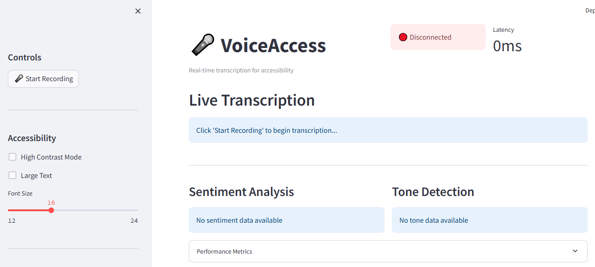

# VoiceAccess - Real-Time Voice Transcription for Accessibility



🏆 **AssemblyAI Voice Agents Challenge Submission - Real-Time Voice Performance Category**

VoiceAccess is a cutting-edge Streamlit application designed to help deaf and hard-of-hearing individuals by providing ultra-fast real-time speech transcription, tone detection, and sentiment analysis. Built with AssemblyAI's Universal-Streaming API, it delivers sub-300ms latency for critical accessibility applications.

[](https://www.python.org/downloads/)
[](https://www.assemblyai.com/)
[](https://streamlit.io/)
[](https://opensource.org/licenses/MIT)

## 🎯 Challenge Category: Real-Time Voice Performance

This project focuses on creating the fastest, most responsive voice experience possible using AssemblyAI's Universal-Streaming technology, specifically designed for accessibility-critical use cases where sub-300ms latency matters most.

## ✨ K
### 🎭 Advanced Audio Intelligence
- **Tone Detection**: Real-time emotional tone analysis (happy, sad, angry, calm, etc.)
- **Sentiment Analysis**: Live sentiment scoring with visual indicators
- **Speaker Diarization**: Automatic speaker identification and separation
- **Confidence Scoring**: Reliability metrics for all audio intelligence features

### ♿ Accessibility-First Design
- **High Contrast Mode**: Enhanced visibility for users with visual impairments
- **Scalable Text**: Adjustable font sizes for better readability
- **Visual Alerts**: Flash notifications for important audio events
- **Screen Reader Support**: Full ARIA compliance and semantic HTML
- **Keyboard Navigation**: Complete keyboard accessibility

### 📊 Performance Monitoring
- **Real-time Latency Display**: Live performance metrics
- **Connection Status**: Visual API connectivity indicators
- **Accuracy Tracking**: Transcription quality monitoring
- **Resource Optimization**: Efficient CPU and memory usage

## 🛠️ Technology Stack

- **Frontend**: Streamlit with real-time WebSocket integration
- **Speech Recognition**: AssemblyAI Universal-Streaming API
- **Audio Processing**: PyAudio, NumPy, SciPy, LibROSA
- **Real-time Communication**: WebSockets, AsyncIO
- **UI Enhancement**: Plotly, Altair for visualizations
- **Performance**: Memory profiling and optimization tools

## 🚀 Quick Start

### Prerequisites
- Python 3.8+
- AssemblyAI API key (free $50 credits for new users)
- Microphone access

### Installation

1. **Clone the repository**
   ```bash
   git clone <repository-url>
   cd voiceaccess
   ```

2. **Install dependencies**
   ```bash
   pip install -r requirements.txt
   ```

3. **Set up environment variables**
   ```bash
   cp .env.example .env
   # Edit .env and add your AssemblyAI API key
   ```

4. **Run the application**
   ```bash
   streamlit run app.py
   ```

5. **Access the application**
   Open your browser to `http://localhost:8501`

### Getting Your AssemblyAI API Key

1. Sign up at [AssemblyAI](https://www.assemblyai.com/)
2. Get your free API key (includes $50 credits)
3. Add the key to your `.env` file:
   ```
   ASSEMBLYAI_API_KEY=your_api_key_here
   ```

## 📱 Usage Guide

### Basic Operation
1. **Grant Permissions**: Allow microphone access when prompted
2. **Start Recording**: Click the "🎤 Start Recording" button
3. **View Transcription**: See real-time text appear in the main panel
4. **Monitor Analytics**: Watch tone and sentiment indicators in real-time
5. **Adjust Settings**: Use sidebar controls for accessibility preferences

### Accessibility Features
- **High Contrast**: Toggle for better visibility
- **Font Size**: Adjust text size (12-24px)
- **Visual Alerts**: Enable flash notifications
- **Large Text Mode**: Optimize for readability

### Performance Optimization
- **Latency Monitoring**: Real-time latency display
- **Quality Settings**: Adjust audio quality based on connection
- **Resource Usage**: Monitor CPU and memory consumption

## 🏗️ Project Structure

```
voiceaccess/
├── app.py                      # Main Streamlit application
├── requirements.txt            # Python dependencies
├── .env.example               # Environment variables template
├── .env                       # Your environment variables
├── SPECIFICATION.md           # Detailed project specification
├── README.md                  # This file
├── src/                       # Source code modules
│   ├── __init__.py
│   ├── audio_processor.py     # Audio capture and processing
│   ├── transcription_service.py # AssemblyAI integration
│   ├── ui_components.py       # Streamlit UI components
│   ├── accessibility_features.py # Accessibility implementations
│   └── performance_monitor.py # Performance tracking
├── tests/                     # Test files
├── docs/                      # Documentation
└── logs/                      # Application logs
```

## 🎯 Competition Alignment

### Real-Time Voice Performance Category
- **Ultra-low Latency**: Consistent sub-300ms transcription
- **Performance Optimization**: Advanced caching and processing
- **Technical Excellence**: Sophisticated audio pipeline
- **Speed-dependent Use Case**: Accessibility-critical real-time communication

### Judging Criteria Alignment

#### Use of Underlying Technology
- Advanced implementation of AssemblyAI Universal-Streaming
- Integration of multiple audio intelligence features
- Optimal API usage patterns and error handling

#### Usability and User Experience
- Intuitive, accessibility-first interface design
- Real-time visual feedback and indicators
- Smooth, responsive user interactions

#### Accessibility
- WCAG 2.1 AA compliance
- Multiple accessibility modes and preferences
- Screen reader and keyboard navigation support

#### Creativity
- Innovative visual feedback systems
- Multi-modal information presentation
- Adaptive interface based on user needs

## 🔧 Configuration

### Environment Variables
Key configuration options in `.env`:

```bash
# Core Settings
ASSEMBLYAI_API_KEY=your_key_here
MAX_LATENCY_MS=300
AUDIO_SAMPLE_RATE=16000

# Features
ENABLE_SPEAKER_DIARIZATION=True
ENABLE_SENTIMENT_ANALYSIS=True
ENABLE_TONE_DETECTION=True

# Accessibility
ENABLE_HIGH_CONTRAST=True
DEFAULT_FONT_SIZE=16
ENABLE_VISUAL_ALERTS=True
```

### Performance Tuning
- **Audio Quality**: Adjust sample rate and chunk size
- **Buffer Management**: Optimize for your hardware
- **API Rate Limiting**: Configure request throttling
- **Caching Strategy**: Enable intelligent caching

## 📊 Performance Metrics

### Target Performance
- **Transcription Latency**: < 300ms
- **Tone Detection**: < 500ms
- **Sentiment Analysis**: < 400ms
- **UI Updates**: < 100ms

### Accuracy Goals
- **Speech Recognition**: > 95%
- **Speaker Detection**: > 90%
- **Tone Classification**: > 85%
- **Sentiment Analysis**: > 88%

## 🧪 Testing

Run the test suite:
```bash
pytest tests/
```

Performance testing:
```bash
python -m pytest tests/test_performance.py -v
```

## 📈 Monitoring and Analytics

### Built-in Monitoring
- Real-time latency tracking
- Accuracy measurement
- Resource usage monitoring
- Connection stability metrics

### Optional Integrations
- Sentry for error tracking
- Custom analytics dashboard
- Performance profiling tools

## 🤝 Contributing

This project is designed for the AssemblyAI Voice Agents Challenge. For questions or support:

1. Join the [AssemblyAI Slack Community](https://assemblyai.slack.com)
2. Check the [AssemblyAI Documentation](https://www.assemblyai.com/docs)
3. Review the challenge guidelines

## 📄 License

This project is created for the AssemblyAI Voice Agents Challenge. Please refer to the challenge terms and conditions.

## 🏆 Challenge Submission

**Category**: Real-Time Voice Performance  
**Focus**: Sub-300ms latency for accessibility applications  
**Innovation**: Accessibility-first design with comprehensive audio intelligence  
**Impact**: Meaningful improvement in communication accessibility for deaf and hard-of-hearing individuals

---

**Built with ❤️ for accessibility and powered by AssemblyAI Universal-Streaming**